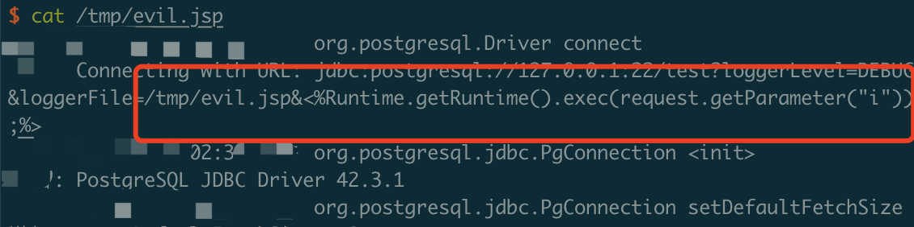

# postgresql Arbitrary File Write Vulnerability

## Reproduction

Run the poc, and you will generate the evil.jsp in the temp dir "/tmp" 

P.S. No need to run a real postgres DB.

## Reference

https://github.com/pgjdbc/pgjdbc/security/advisories/GHSA-673j-qm5f-xpv8